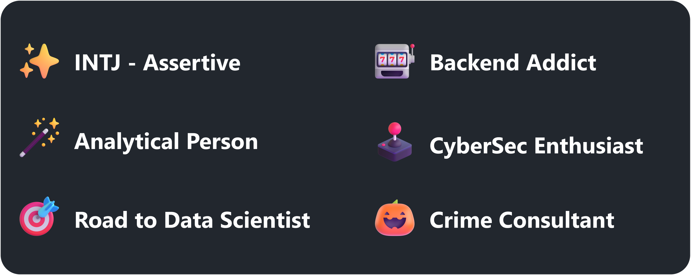

## Hello, You can Call Me Odin :green_heart:

 

 

<h2>:chart_with_upwards_trend: My Github Statistics</h2>

    
      
      
    

## 

Markdown Created with :coffee: By <a href="https://github.com/its0din-ai">its0din-ai</a>

